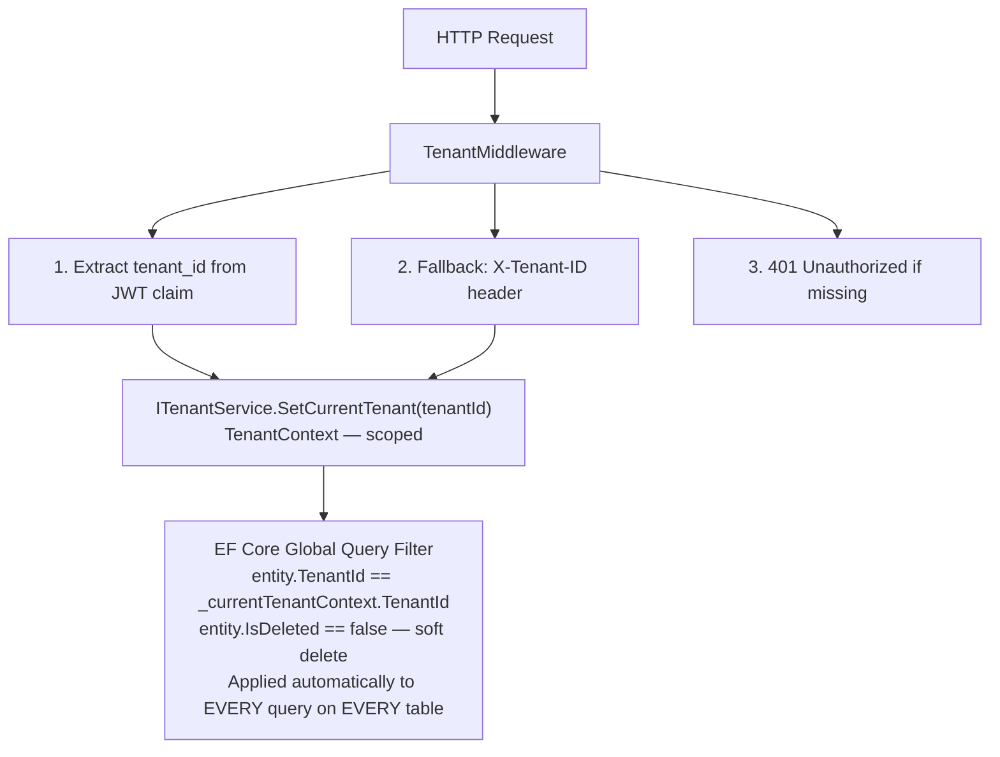
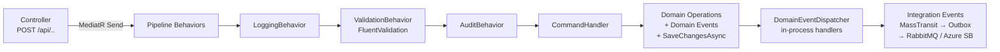
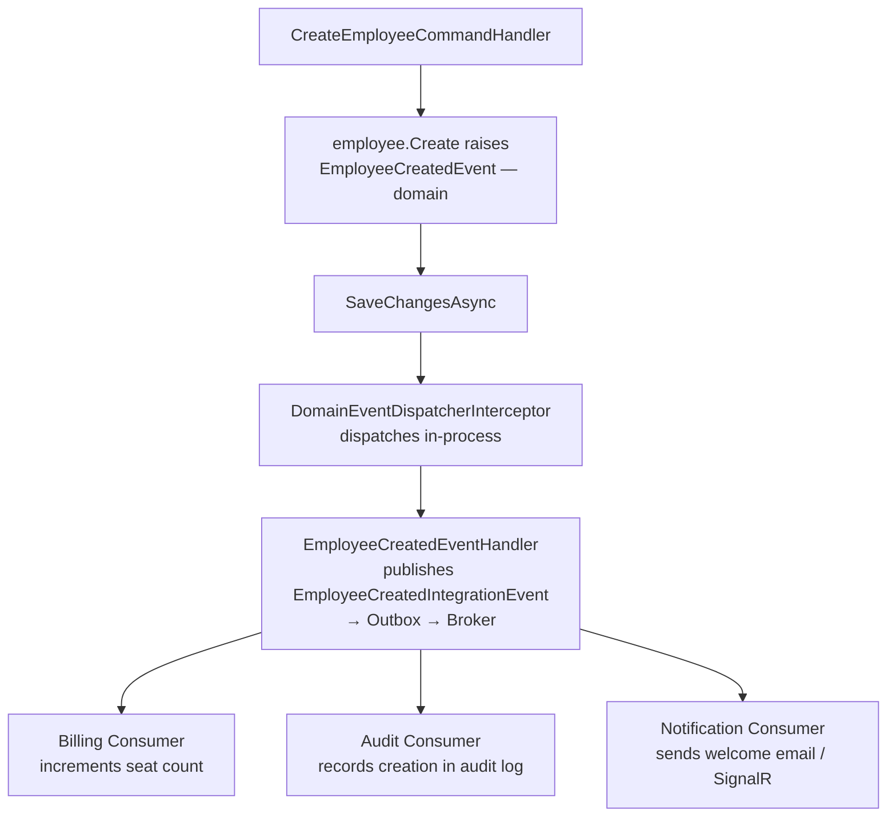
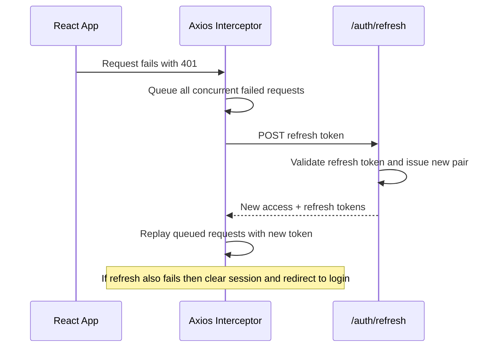
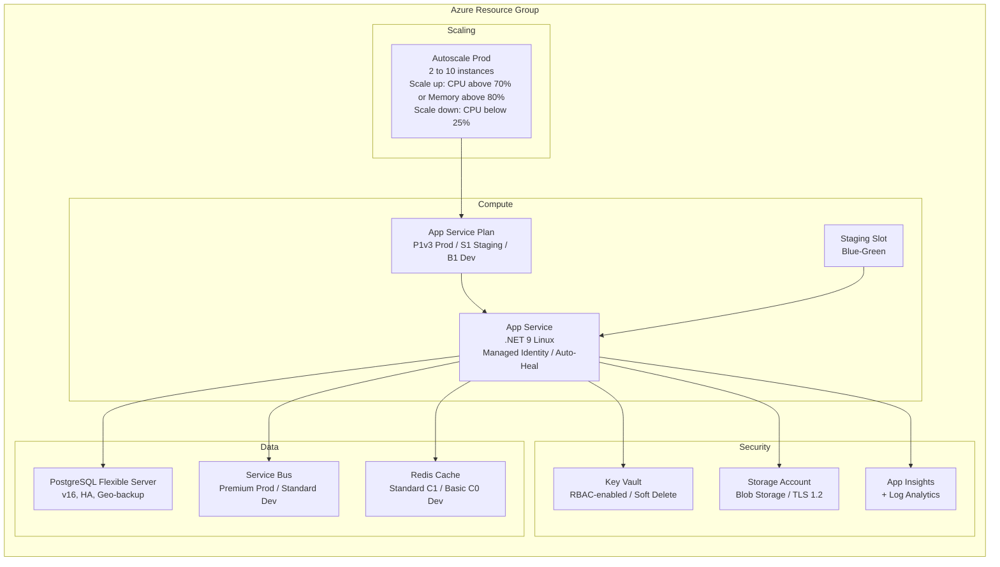
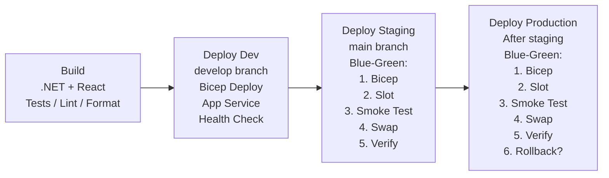
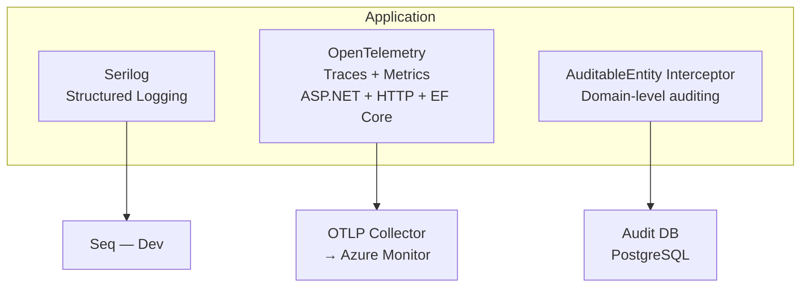

# HrSaas — Multi-Tenant SaaS HR Management System

[](https://dotnet.microsoft.com)
[](https://react.dev)
[](https://www.typescriptlang.org)
[](https://www.postgresql.org)
[](docs/architecture.md)
[](/.github/workflows)
[](LICENSE)

A **production-grade, multi-tenant SaaS HR management platform** built with .NET 9 and React 19, demonstrating evolutionary architecture from Modular Monolith to Microservices — with full CI/CD, Azure IaC, observability, and blue-green deployments.

---

## Table of Contents

- [Architecture Overview](#architecture-overview)
- [System Architecture Diagram](#system-architecture-diagram)
- [Clean Architecture Layers](#clean-architecture-layers)
- [Module Breakdown](#module-breakdown)
- [Multi-Tenancy Design](#multi-tenancy-design)
- [CQRS & Event-Driven Architecture](#cqrs--event-driven-architecture)
- [Tech Stack](#tech-stack)
- [Project Structure](#project-structure)
- [Quick Start](#quick-start)
- [API Reference](#api-reference)
- [Authentication & Authorization](#authentication--authorization)
- [Infrastructure & Deployment](#infrastructure--deployment)
- [CI/CD Pipeline](#cicd-pipeline)
- [Observability](#observability)
- [Feature Flags](#feature-flags)
- [Testing Strategy](#testing-strategy)
- [Documentation](#documentation)
- [Roadmap](#roadmap)

---

## Architecture Overview

```mermaid
graph TB
    subgraph Clients
        SPA["React 19 SPA"]
        Mobile["Mobile Apps"]
        API_C["API Consumers"]
    end

    subgraph Gateway
        YARP["YARP API Gateway<br/>Reverse Proxy / Rate Limiting / Routing"]
    end

    subgraph Host["HrSaas.Api — Unified Host"]
        direction TB
        MW["Middleware Pipeline<br/>ForwardedHeaders → Compression → Serilog → FeatureFlags<br/>→ Exception → CORS → Auth → RateLimiter → Tenant → Idempotency"]
        CTRL["13 API Controllers<br/>Auth / Users / Roles / Tenants / Employees / Leave / Billing<br/>Files / Notifications / NotifPrefs / Templates / AuditLogs / Features"]
        PIPE["MediatR Pipeline<br/>LoggingBehavior → ValidationBehavior → AuditBehavior"]
        MW --> CTRL --> PIPE
    end

    subgraph Modules["Feature Modules"]
        direction LR
        Identity["Identity<br/>JWT / RBAC / Roles"]
        Tenant["Tenant<br/>Plans / Status / Config"]
        Employee["Employee<br/>CRUD / Import / Search"]
        Leave["Leave<br/>Workflow / Approval / Balance"]
        Billing["Billing<br/>Subscriptions / Invoicing / Seats"]
        Notifications["Notifications<br/>Email / SignalR / Templates"]
        Audit["Audit<br/>Change Tracking / Event Sourcing"]
        Storage["Storage<br/>Azure Blob / Local / Presigned URLs"]
    end

    subgraph Blocks["Building Blocks — Shared Infra"]
        direction LR
        SK["SharedKernel<br/>BaseEntity / Result / CQRS"]
        EB["EventBus<br/>MassTransit / Outbox"]
        TS["TenantSdk<br/>Middleware / ITenantSvc"]
        CT["Contracts<br/>Integration Events / DTOs"]
        IS["Infrastructure.Storage<br/>Azure Blob / Local Provider"]
        JS["JobScheduler<br/>Hangfire / Recurring Jobs"]
    end

    subgraph Infra["External Infrastructure"]
        PG["PostgreSQL 16<br/>8 schemas"]
        RMQ["RabbitMQ 3.13<br/>or Azure SB"]
        Redis["Redis 7<br/>Cache"]
        Blob["Azure Blob<br/>or Local"]
        Seq["Seq / OTLP<br/>Telemetry"]
    end

    Clients -->|HTTPS| Gateway
    Gateway --> Host
    Host --> Modules
    Modules --> Blocks
    Blocks --> Infra
```



---

## Clean Architecture Layers

Each module follows strict **Clean Architecture** with enforced dependency rules:

```mermaid
block-beta
    columns 1
    block:api["API Layer — Controllers / Middleware / DI Registration"]
    end
    block:app["Application Layer — Commands / Queries / Handlers / DTOs / Validators"]
    end
    block:infra["Infrastructure Layer — EF Core / Repositories / External Services"]
    end
    block:domain["Domain Layer — Entities / Value Objects / Aggregates / Domain Events"]
    end

    api --> app
    app --> domain
    infra --> app
    infra --> domain
```

**Hard Dependency Rules:**
- Domain MUST NOT reference Application, Infrastructure, or API
- Application MUST NOT reference Infrastructure or API
- Modules MUST NOT reference each other directly
- Cross-module communication via `IEventBus` or shared `Contracts`
- Controllers call only `IMediator.Send()` / `IMediator.Publish()`

---

## Module Breakdown

| Module | Responsibility | DB Schema | Extraction Ready |
|--------|---------------|-----------|------------------|
| **Identity** | Registration, login, JWT issuance, RBAC, roles & permissions | `identity` | Yes — High priority |
| **Tenant** | Company CRUD, plan assignment, status management | `tenant` | Yes — Medium |
| **Employee** | Employee lifecycle CRUD, bulk import, search | `employee` | No — Stays in monolith |
| **Leave** | Leave application, approval workflow, balance tracking | `leave` | No — Stays in monolith |
| **Billing** | Subscription plans, invoicing, seat tracking, payment hooks | `billing` | Yes — High priority |
| **Notifications** | Email dispatch, SignalR real-time, templates, preferences | `notification` | No — Stays in monolith |
| **Audit** | Change tracking, event sourcing, query & export | `audit` | No — Stays in monolith |
| **Storage** | File upload/download, Azure Blob / Local, presigned URLs | `storage` | No — Stays in monolith |

Each module owns its own `DbContext`, migrations, and schema — enforcing clear data boundaries for future microservice extraction.

---

## Multi-Tenancy Design

This system uses the **Shared Database, Shared Schema** strategy with row-level isolation via `TenantId`:



Every aggregate root inherits from `BaseEntity` which includes:
- `Id` (Guid) — primary key
- `TenantId` (Guid) — tenant isolation
- `CreatedAt` / `UpdatedAt` — audit timestamps
- `IsDeleted` — soft delete
- `DomainEvents` — collected for dispatch after SaveChanges

---

## CQRS & Event-Driven Architecture

### Command/Query Separation



### Event Flow Example



---

## Tech Stack

### Backend

| Category | Technology | Version |
|----------|-----------|---------|
| Runtime | .NET / C# | 9.0 / 13.0 |
| ORM | Entity Framework Core + Npgsql | 9.0.3 |
| CQRS | MediatR | 12.4.1 |
| Validation | FluentValidation | 11.11.0 |
| Messaging | MassTransit (RabbitMQ / Azure Service Bus) | 8.3.6 |
| Database | PostgreSQL | 16 |
| Caching | Redis (StackExchange.Redis) | 7 / 2.8.24 |
| Auth | JWT Bearer + BCrypt | 9.0.3 / 4.0.3 |
| Logging | Serilog + Seq | 8.0.3 |
| Telemetry | OpenTelemetry + Azure Monitor | 1.12.0 |
| Jobs | Hangfire + PostgreSQL storage | 1.8.17 |
| Feature Flags | Microsoft.FeatureManagement | 4.4.0 |
| Resilience | Microsoft.Extensions.Http.Resilience + Polly | 9.4.0 / 8.6.0 |
| API Docs | Scalar (OpenAPI) | 2.13.19 |
| API Versioning | Asp.Versioning.Mvc | 8.1.0 |
| Gateway | YARP Reverse Proxy | 2.3.0 |
| Cloud Storage | Azure.Storage.Blobs + Azure.Identity | 12.23.0 / 1.13.2 |

### Frontend

| Category | Technology | Version |
|----------|-----------|---------|
| Framework | React | 19 |
| Language | TypeScript | 5.9 |
| Build Tool | Vite | 8 |
| UI Library | MUI (Material UI) | 7 |
| Data Grid | MUI X Data Grid | 8 |
| Charts | Recharts | 3 |
| Data Fetching | TanStack React Query | 5 |
| HTTP Client | Axios (with token refresh interceptor) | — |
| Forms | React Hook Form + Zod | 7 / 4 |
| Routing | React Router | 7 |
| Notifications | Notistack | — |

### Infrastructure

| Category | Technology |
|----------|-----------|
| Containerization | Docker + Docker Compose |
| IaC | Azure Bicep |
| CI/CD | GitHub Actions + Azure Pipelines |
| Cloud | Azure App Service, Static Web Apps, Key Vault, Storage, Service Bus, Redis Cache |
| Deployment | Blue-green with slot swaps + auto-rollback |
| Reverse Proxy | nginx 1.27 (frontend), YARP (backend) |

---

## Project Structure

```
multi-tenant-saas/
├── .github/
│   ├── copilot-instructions.md            # AI coding rules & architecture spec
│   └── workflows/
│       ├── ci-cd.yml                      # GitHub Actions (4-job pipeline)
│       └── azure-pipelines.yml            # Azure DevOps (5-stage pipeline)
│
├── docs/
│   ├── architecture.md                    # Full system design document
│   ├── skills.md                          # Developer onboarding guide
│   └── ADR/                               # Architecture Decision Records
│       ├── ADR-001-modular-monolith.md
│       ├── ADR-002-multi-tenancy.md
│       ├── ADR-003-cqrs-mediatr.md
│       ├── ADR-004-event-driven.md
│       └── ADR-005-microservice-extraction.md
│
├── infra/
│   └── main.bicep                         # Azure infrastructure (13+ resources)
│
├── scripts/
│   └── db/init.sql                        # 8 schemas + outbox table + indexes
│
├── src/
│   ├── Api/
│   │   └── HrSaas.Api/                   # Unified host, 13 controllers, middleware
│   │       ├── Controllers/               # Auth, Users, Roles, Tenants, Employees,
│   │       │                              # Leave, Billing, Files, Notifications,
│   │       │                              # NotificationPrefs, Templates, Audit, Features
│   │       ├── Infrastructure/            # Idempotency, Resilience, FeatureGates,
│   │       │                              # HealthChecks, RateLimiting, SignalR
│   │       ├── Middleware/                # Exception handling, audit context
│   │       ├── Dockerfile                 # Multi-stage .NET 9 container
│   │       └── Program.cs                 # Full DI composition root
│   │
│   ├── Modules/                           # 8 bounded context modules
│   │   ├── Identity/                      # Auth, JWT, users, roles, permissions
│   │   ├── Tenant/                        # Company management, plans
│   │   ├── Employee/                      # HR employee lifecycle
│   │   ├── Leave/                         # Leave workflow & balance
│   │   ├── Billing/                       # Subscriptions, invoicing
│   │   ├── Notifications/                 # Email, SignalR, templates
│   │   ├── Audit/                         # Change tracking, event log
│   │   └── Storage/                       # File upload/download
│   │
│   ├── BuildingBlocks/                    # Shared infrastructure (no business logic)
│   │   ├── SharedKernel/                  # BaseEntity, Result<T>, CQRS interfaces
│   │   ├── Infrastructure/                # Azure Blob + Local storage providers
│   │   ├── EventBus/                      # MassTransit, outbox, consumers
│   │   ├── TenantSdk/                     # TenantMiddleware, ITenantService
│   │   ├── Contracts/                     # Integration events, shared DTOs
│   │   └── JobScheduler/                  # Hangfire setup, recurring jobs
│   │
│   ├── Gateway/                           # YARP reverse proxy (microservice phase)
│   │
│   └── Web/HrSaas.Web/                   # React 19 SPA
│       ├── src/features/                  # Domain-driven feature folders
│       ├── nginx.conf                     # Security-hardened nginx config
│       └── Dockerfile                     # Multi-stage Node 22 + nginx 1.27
│
├── tests/
│   ├── HrSaas.Modules.Employee.UnitTests/ # Domain + Application unit tests
│   ├── HrSaas.Consumers.UnitTests/        # MassTransit consumer tests
│   └── HrSaas.IntegrationTests/           # WebApplicationFactory E2E tests
│
├── docker-compose.yml                     # Full local stack (8 services)
├── docker-compose.override.yml            # Dev hot-reload overrides
├── Directory.Build.props                  # Shared MSBuild properties
├── Directory.Packages.props               # Central Package Management
├── global.json                            # SDK version pinning (9.0.200)
└── HrSaas.sln                             # 20 projects
```

---

## Quick Start

### Prerequisites

- [.NET 9 SDK](https://dotnet.microsoft.com/download/dotnet/9.0) (9.0.200+)
- [Node.js 22](https://nodejs.org/) (for frontend)
- [Docker Desktop](https://www.docker.com/products/docker-desktop)

### Option 1: Docker Compose (Recommended)

```bash
git clone https://github.com/your-org/multi-tenant-saas.git
cd multi-tenant-saas

# Start everything — API, Web, PostgreSQL, RabbitMQ, Redis, Seq, Azurite, OTLP Collector
docker-compose up -d
```

| Service | URL | Credentials |
|---------|-----|-------------|
| **React App** | http://localhost:3000 | — |
| **API** | http://localhost:5000 | — |
| **Scalar API Docs** | http://localhost:5000/scalar/v1 | — |
| **RabbitMQ Management** | http://localhost:15672 | guest / guest |
| **Seq Log Viewer** | http://localhost:5341 | — |
| **Hangfire Dashboard** | http://localhost:5000/hangfire | — |

### Option 2: Local Development

```bash
# Start infrastructure only
docker-compose up -d postgres rabbitmq redis seq azurite

# Run the API (auto-migrates DB in Development mode)
cd src/Api/HrSaas.Api
dotnet run

# In another terminal — run the frontend
cd src/Web/HrSaas.Web
npm install
npm run dev
```

### Option 3: Dev Hot-Reload

```bash
# Uses docker-compose.override.yml — mounts source and uses dotnet watch
docker-compose -f docker-compose.yml -f docker-compose.override.yml up
```

---

## API Reference

### Authentication
```http
POST   /api/v1/auth/register          # Register new user + tenant
POST   /api/v1/auth/login             # Login → JWT access + refresh tokens
POST   /api/v1/auth/refresh           # Refresh expired access token
GET    /api/v1/auth/me                # Get current user claims
```

### Users & Roles
```http
GET    /api/v1/users                   # List users in tenant
GET    /api/v1/users/{id}              # Get user details
PUT    /api/v1/users/{id}/role         # Assign role [Admin]
GET    /api/v1/roles                   # List available roles
POST   /api/v1/roles                   # Create custom role [Admin]
```

### Tenants
```http
GET    /api/v1/tenants/{id}            # Get tenant details
PUT    /api/v1/tenants/{id}            # Update tenant [Admin]
```

### Employees
```http
GET    /api/v1/employees               # List employees (paginated, filtered)
GET    /api/v1/employees/{id}          # Get employee by ID
POST   /api/v1/employees               # Create employee [Admin, Manager]
PUT    /api/v1/employees/{id}          # Update employee [Admin, Manager]
DELETE /api/v1/employees/{id}          # Soft delete employee [Admin]
```

### Leave Management
```http
GET    /api/v1/leaves                  # List leave requests
GET    /api/v1/leaves/{id}             # Get leave details
GET    /api/v1/leaves/employee/{id}    # Get by employee
GET    /api/v1/leaves/balance/{empId}  # Get leave balance
POST   /api/v1/leaves                  # Apply for leave
PUT    /api/v1/leaves/{id}/approve     # Approve [Manager, Admin]
PUT    /api/v1/leaves/{id}/reject      # Reject [Manager, Admin]
DELETE /api/v1/leaves/{id}             # Cancel leave request
```

### Billing
```http
GET    /api/v1/billing/subscription    # Get current subscription
POST   /api/v1/billing/subscribe       # Create free subscription
POST   /api/v1/billing/activate        # Activate paid plan
GET    /api/v1/billing/invoices        # List invoices
```

### File Storage
```http
POST   /api/v1/files/upload            # Upload file (multipart)
GET    /api/v1/files/{id}/download     # Download file
GET    /api/v1/files/{id}/url          # Get presigned URL
DELETE /api/v1/files/{id}              # Delete file
GET    /api/v1/files                   # List tenant files
```

### Notifications
```http
GET    /api/v1/notifications           # List notifications
PUT    /api/v1/notifications/{id}/read # Mark as read
GET    /api/v1/notification-preferences           # Get preferences
PUT    /api/v1/notification-preferences           # Update preferences
GET    /api/v1/notification-templates              # List templates [Admin]
POST   /api/v1/notification-templates              # Create template [Admin]
```

### Audit & Feature Flags
```http
GET    /api/v1/audit-logs              # Query audit trail
GET    /api/v1/features                # List active feature flags
```

### Health Checks
```http
GET    /health/live                    # Liveness probe
GET    /health/ready                   # Readiness (DB, Redis, RabbitMQ, Storage)
```

---

## Authentication & Authorization

### JWT Token Structure

```json
{
  "sub": "a1b2c3d4-e5f6-7890-abcd-ef1234567890",
  "email": "alice@acmecorp.com",
  "tenant_id": "f0e1d2c3-b4a5-6789-0abc-def123456789",
  "role": "Admin",
  "permissions": ["employees.view", "employees.create", "leaves.approve"],
  "exp": 1712016000
}
```

### Token Refresh Flow



### Permission-Based Authorization

```
Role: Admin     → employees.*, leaves.*, billing.manage, tenants.*
Role: Manager   → employees.view/create, leaves.view/create/approve
Role: Employee  → employees.view (self), leaves.view/create/cancel (self)
```

---

## Infrastructure & Deployment

### Azure Resources (Bicep IaC)



### Environment Configuration

| Environment | Database | Messaging | Compute | Cache |
|-------------|----------|-----------|---------|-------|
| **Development** | PostgreSQL (Docker) | RabbitMQ (Docker) | Local / B1 | Redis (Docker) |
| **Staging** | PostgreSQL Flex (Standard) | Azure Service Bus (Standard) | S1 | Redis Standard C1 |
| **Production** | PostgreSQL Flex (HA, Geo-backup) | Azure Service Bus (Premium) | P1v3 (Autoscale 2-10) | Redis Standard C1 |

---

## CI/CD Pipeline

### GitHub Actions (Blue-Green Deployment)



**Key Features:**
- Passwordless Azure auth via OIDC (`id-token: write`)
- Frontend deployed to Azure Static Web Apps
- Automatic rollback on production health check failure
- Artifact caching between jobs
- Dual pipeline support: GitHub Actions + Azure Pipelines

---

## Observability



Every log event is enriched with: `TenantId`, `UserId`, `CorrelationId`, `Environment`, `ThreadId`, `SpanId`.

---

## Feature Flags

Managed via `Microsoft.FeatureManagement`, configurable per environment:

| Flag | Dev | Staging | Production |
|------|-----|---------|------------|
| `BulkEmployeeImport` | Yes | Yes | No |
| `AdvancedReporting` | Yes | Yes | No |
| `LeaveApprovalWorkflow` | Yes | Yes | Yes |
| `EmailNotifications` | Yes | Yes | Yes |
| `SlackIntegration` | Yes | Yes | No |
| `AuditLog` | Yes | Yes | Yes |
| `CustomRoles` | Yes | Yes | No |
| `MultiCurrencyBilling` | No | No | No |
| `EmployeeSelfService` | Yes | Yes | Yes |
| `ApiWebhooks` | Yes | Yes | No |

---

## Testing Strategy

| Layer | Test Type | Framework | Location |
|-------|-----------|-----------|----------|
| Domain | Unit tests | xUnit + FluentAssertions | `tests/HrSaas.Modules.Employee.UnitTests/` |
| Application | Unit tests | xUnit + NSubstitute + Bogus | `tests/HrSaas.Modules.Employee.UnitTests/` |
| Consumers | Unit tests | xUnit + NSubstitute + MassTransit.Testing | `tests/HrSaas.Consumers.UnitTests/` |
| API | Integration / E2E | WebApplicationFactory + Testcontainers | `tests/HrSaas.IntegrationTests/` |

```bash
# Run all tests
dotnet test

# Run specific test project
dotnet test tests/HrSaas.Modules.Employee.UnitTests

# Run with coverage
dotnet test --collect:"XPlat Code Coverage"
```

Multi-tenancy is validated in tests — seed data for Tenant A, assert Tenant B cannot see it.

---

## Documentation

| Document | Description |
|----------|-------------|
| [Architecture Overview](docs/architecture.md) | Full system design, data flow, deployment |
| [Skills Guide](docs/skills.md) | Developer onboarding and patterns |
| [ADR-001: Modular Monolith](docs/ADR/ADR-001-modular-monolith.md) | Why modular monolith over microservices |
| [ADR-002: Multi-Tenancy](docs/ADR/ADR-002-multi-tenancy.md) | Shared DB with row-level isolation |
| [ADR-003: CQRS + MediatR](docs/ADR/ADR-003-cqrs-mediatr.md) | Command/Query separation pattern |
| [ADR-004: Event-Driven](docs/ADR/ADR-004-event-driven.md) | Domain events to Integration events |
| [ADR-005: Microservice Extraction](docs/ADR/ADR-005-microservice-extraction.md) | Extraction strategy for Identity and Billing |
| [Copilot Instructions](.github/copilot-instructions.md) | AI coding rules and conventions |

---

## Roadmap

### Phase 1 — Modular Monolith (Complete)
- [x] Multi-tenancy with EF Core global query filters
- [x] JWT authentication with tenant claims and refresh tokens
- [x] CQRS with MediatR + FluentValidation pipeline
- [x] 8 feature modules (Identity, Tenant, Employee, Leave, Billing, Notifications, Audit, Storage)
- [x] Event-driven architecture with MassTransit + Outbox
- [x] Permission-based authorization (RBAC)
- [x] File storage (Azure Blob + Local)
- [x] Real-time notifications via SignalR
- [x] Audit trail with change tracking
- [x] Background jobs with Hangfire
- [x] Feature flag management
- [x] React 19 SPA with MUI, TanStack Query, domain-driven structure
- [x] Full CI/CD with blue-green deployments
- [x] Azure IaC with Bicep (13+ resources)
- [x] OpenTelemetry + Serilog observability
- [x] Security hardening (CORS, CSP, rate limiting, nginx headers)

### Phase 2 — Service Extraction
- [ ] Extract Identity module to standalone service
- [ ] Extract Billing module to standalone service
- [ ] YARP gateway routing configuration
- [ ] Per-service database migrations
- [ ] Distributed tracing across services

### Phase 3 — Scale
- [ ] Database-per-tenant for enterprise plans
- [ ] Kubernetes deployment manifests
- [ ] Horizontal pod autoscaling
- [ ] Multi-region deployment
- [ ] Webhook system for external integrations

---

## License

This project is licensed under the [MIT License](LICENSE).
